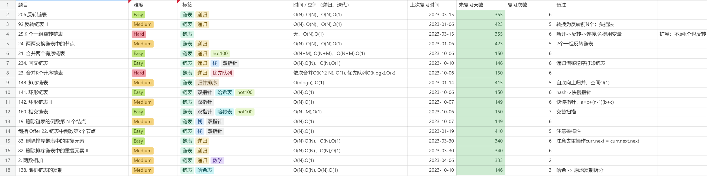
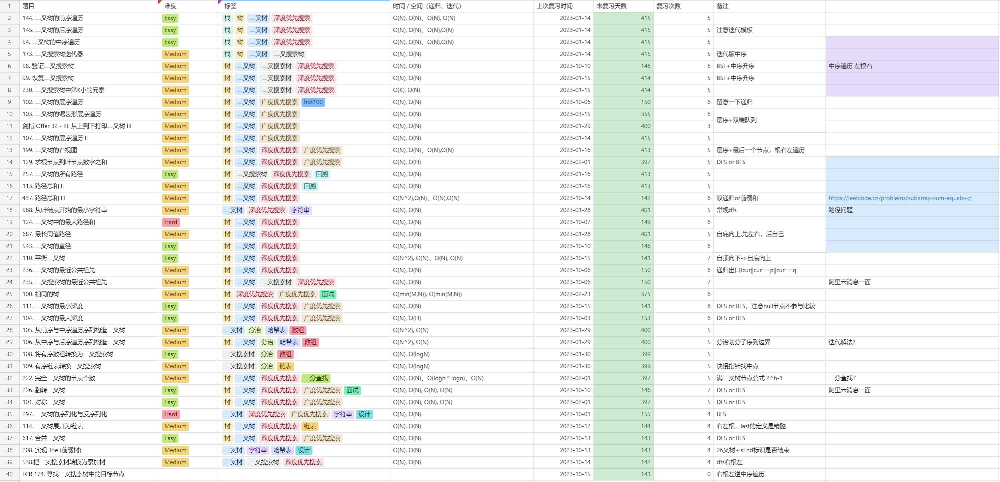
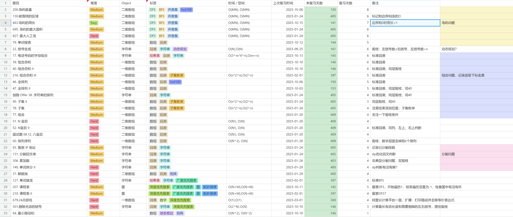
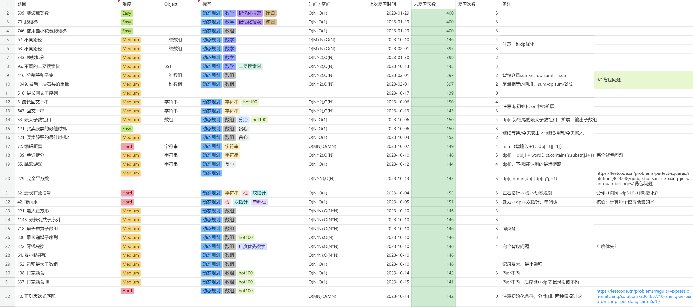
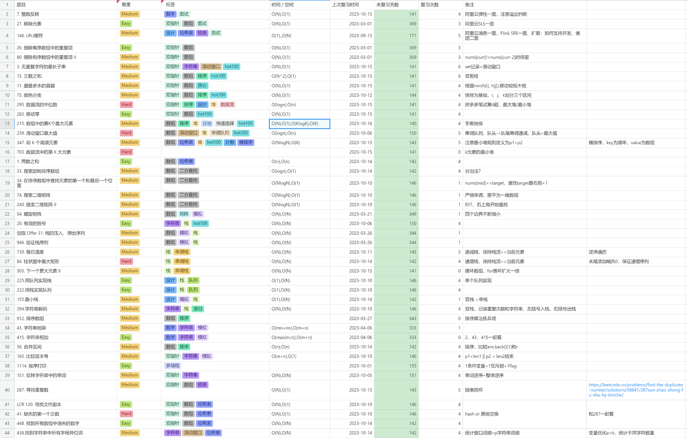
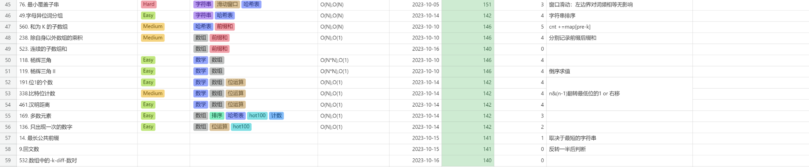
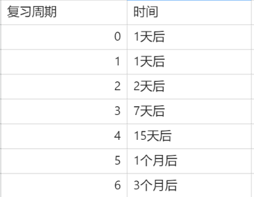

# 刷题顺序

1. [CodeTop](https://codetop.cc/home) 高频题
2. [LeetCode](https://leetcode.cn/studyplan/top-100-liked/) Hot100

# 题单

## 链表



## 树



## DFS / BFS



## DP



## 小专题




# 复习频率



# Tips

## 二叉树的前中后序遍历（144、94、145）

注意结果打印位置即可

- 前序

```c++
while (root || !stack.empty()) {
    while (root)
    {
        res.push_back(root->val);
        stack.push(root);
        root = root->left;
    }

    root = stack.top();
    stack.pop();
    root = root->right;
}
```

- 中序

```c++
while (root || !stack.empty()) {
    while (root) {
        stack.push(root);
        root = root->left;
    }

    root = stack.top();
    stack.pop();
    res.push_back(root->val);
    root = root->right;
}
```

- 后序

```c++
while (root || !stack.empty()) {
    while (root) {
        res.push_back(root->val);
        stack.push(root);
        root = root->right;
    }

    root = stack.top();
    stack.pop();
    root = root->left;
}

reverse(res.begin(), res.end());
```

## 组合问题

### 下标记录回溯深度的场景

- 以下标 i 来表示从 i 开始选取避免重复
- 对结果顺序无要求：[1,2] 和 [2,1] 算是同一种结果
- 39.组合综合、40.组合总和II、216.组合总和III等

```c++
for (int i = idx; i < candidates.size(); i++) {
    if (rest - candidates[i] >= 0) {
        path.push_back(candidates[i]);
        dfs(candidates, rest - candidates[i], i);
        path.pop_back();
    }
}
```

### used 数组使用的场景

- 用`used[i]`来表示已经选过避免重复
- 对结果顺序有要求：[1,2] 和 [2,1] 算是不同结果
- 46.全排列、47.全排列II、剑指Offer38.字符串的排列

```c++
for (int i = 0; i < nums.size(); i++) {
    if (used[i])
        continue;
    used[i] = 1;
    path.push_back(nums[i]);
    dfs(nums);
    path.pop_back();
    used[i] = 0;
}
```

### 需要排序剪枝的场景

- 排序后判断`nums[i]==nums[i-1]`跳过选择避免重复
- 数组中有重复元素：数组 [1,2,2,3]，选择 0、1 元素和选择 0、2 元素产生的结果相同
- 40.组合总和II、47.全排列II、剑指Offer38.字符串的排列、90.子集II

```c++
for (int i = idx; i < candidates.size(); i++) {
    // 同层不重复，同路径可以重复
    if (i > idx && candidates[i] == candidates[i - 1])
        continue;
    ...
}
```
